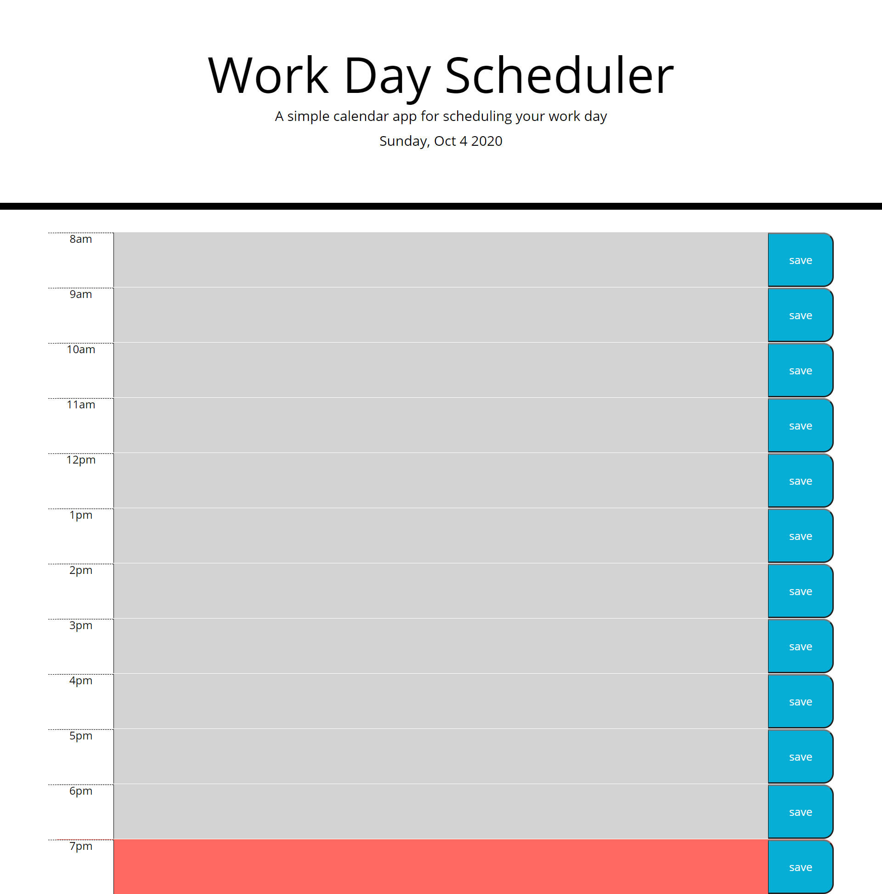

# Homework05 Day Planner

Link to site: [https://ctrahan94.github.io/homework05_day_planner/](https://ctrahan94.github.io/homework05_day_planner/)

link to repo: [https://github.com/ctrahan94/homework05_day_planner](https://github.com/ctrahan94/homework05_day_planner) 

## The Objective

Create a simple calendar application that allows the user to save events for each hour of the day.

## The Motive
For users to create a list of tasks to complete for the current date.  

## The Solution
Used javascript and jquery to create elements on the webpage and created rows for each time block. I created a text area that allows users to add the task they would like to get done for that hour and created an "onClick" that allows the save button to work and save to local storage and display the message back on the webpage once the page has been refreshed

### What the deployed site looks like
#### Main Page

